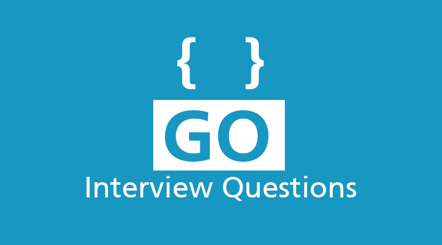

# Go-Interview-Questions-And-Answers



 <h2 id="-" dir="rtl" style="color:darkmagenta"> 🌱چه تایپ هایی مقدار zero آن ها nil هست؟</h2>  
 <p>interfaces, slices, channels, maps, pointers and functions.</p>

 <h2 id="-" dir="rtl"> 🌱تایپ های نوع Reference؟</h2>  
 <p>Pointers, slices, maps, functions, and channels</p>
 
 <h2 id="-" dir="rtl"> 🌱تایپ های نوع Aggregate؟</h2>  
 <p>Array and structs</p>
 
 <h2 id="-" dir="rtl">🌱چه وقت باید از پوینتر استفاده کنیم؟</h2>   
 <p dir="rtl">
1- تابعی که یکی از پارامترهای خود را تغییر می‌دهد
<br>
-وقتی تابعی را فراخوانی می‌کنیم که یک پوینتر را به عنوان پارامتر می‌گیرد، انتظار داریم که متغیر ما تغییر داده شود. اگر شما متغیر را در تابع خود تغییر نمی‌دهید، پس احتمالا نباید از پوینتر استفاده کنید.
 </p>
 <p dir="rtl">
2- عملکرد بهتر
<br>
-اگر رشته‌ای داشته باشید که شامل یک رمان کامل در حافظه باشد، کپی کردن این متغیر هر بار که به یک تابع جدید ارسال می‌شود، کاری بسیار گران است. ممکن است ارزشمند باشد که به جای این کار یک پوینتر را ارسال کنید، که باعث صرفه‌جویی در پردازنده و حافظه می‌شود. با این حال انجام این کار به قمیت خوانا بودن است، بنابراین فقط در صورت لزوم این بهینه‌سازی را انجام دهید.
  </p>
 <p dir="rtl">
3- به گزینه nil نیاز دارید
<br>
-گاهی اوقات یک تابع باید بداند که مقدار یک چیزی چیست، همچنین باید وجود یا عدم وجود آن را بداند. معمولا هنگام خواندن JSON از این استفاده می‌کنیم تا بدانیم فیلدی وجود دارد یا خیر.
 </p>
 
<h2 id="-" dir="rtl">🌱مزایای زبان گولنگ</h2>  
<p>

* Compilation time is fast
* InBuilt concurrency support: light-weight processes (via goroutines), channels, select statement
* Conciseness, Simplicity, and Safety.
* Production of statically linked native binaries without external dependencies.
* Support for Interfaces and Type embdding.
<br>

Embedded

```go
type PremiumDiscount struct{
    Discount //Embedded
    additional float32
}
```

by-value

```go
type Parent struct{
    value int64
}

func (i *Parent) Value() int64{
    return i.value
}

type Child struct{
    Parent
    multiplier int64
}

func (i Child) Value() int64{
    return i.value * i.multiplier
}
```
By-Pointer
```go
type Bitmap struct{
    data [4][4]bool
}

type Renderer struct{
    *Bitmap //Embed by pointer
    on uint8
    off uint8
}
```
Embed an interface
```go
type echoer struct{
    io.Reader
}
```
Embedding an interface by pointer
```go
type echoer struct{
    *io.Reader
}
```

</p>

 <h2 id="-" dir="rtl"> 🌱زبان گولنگ از موارد زیر پشتیبانی نمی کند</h2>  
 <p>
 
* type inheritance
* operator overloading
* method overloading
* pointer arithmetic
 </p>

 <h2 id="-" dir="rtl"> 🌱 فرق Atomic و mutex؟</h2>  
 <p>

به عبارتی وقتی شما از توابع اتومیک استفاده می‌کنید صرفا یک قسمتی از حافظه رو لاک می‌کنید. اون هم در یک بازی زمانی بسیار کوتاه. ولی زمانی که از موتکس استفاده می‌کنید، یک بلوک کد رو لاک می‌کنید
 </p>

 <h2 id="-" dir="rtl"> 🌱 چه موقعی از channel و چه موقعی از mutex استفاده میشه برای گورتینگ ها؟(بحث ارتباط)؟ </h2>  
 <p id="-" dir="rtl">
معمولاً در مواقعی که Goroutines نیاز به برقراری ارتباط با یکدیگر دارند از channels  استفاده کنید 
و درصورتی که فقط یک Goroutine دارید و باید به بخش مهم کد دسترسی داشته باشد از Mutexes استفاده کنید.
 </p>

 <h2 id="-" dir="rtl"> 🌱 چرا کپی کردن pointer کند تر از کپی کردن مقدار هست؟</h2>  
 <p  id="-" dir="rtl">
- برای ارسال مقادیر کوچیکی که به مقدارشون فقط نیاز داریم از پوینتر استفاده نکنیم. <br>
- توی متغیرهای کوچیک (کمتر از ۳۲کیلوبایت) کپی کردن یک پوینتر تقریبا به اندازه کپی کردن مقدار اون متغیر هزینه داره  پس از این جهت سودی نمیبریم.<br>
- کامپایلر چک هایی رو تولید میکنه که موقع ران‌تایم زمان dereferencing پوینتر اجرا میشن.<br>
- پوینتر ها اکثرا توی Heap ذخیره میشن<br>
- برای این کار از ابزار های Go استفاده میکنیم ( go build -gcflags="-m" main.go )<br>
- اما اگر به صورت مقداری برگردونیم در stack ذخیره میشه.<br>
- همونطوری که میدونیم ذخیره در stack بسیار بهینه تر هست.<br>
- درواقع Garbage collector میاد heap رو چک میکنه و همونطوری که میدونیم هربار GC درحال بررسی هست به مدت چند میلی‌ثانیه کل سرویس ما فریز میشه. و میتونه مشکل هایی مثل Memory Leak و .. بوجود بیاد<br>
 </p>

 <h2 id="-" dir="rtl"> 🌱 سوال؟</h2>  
 <p  id="-" dir="rtl">
 جواب
 </p>